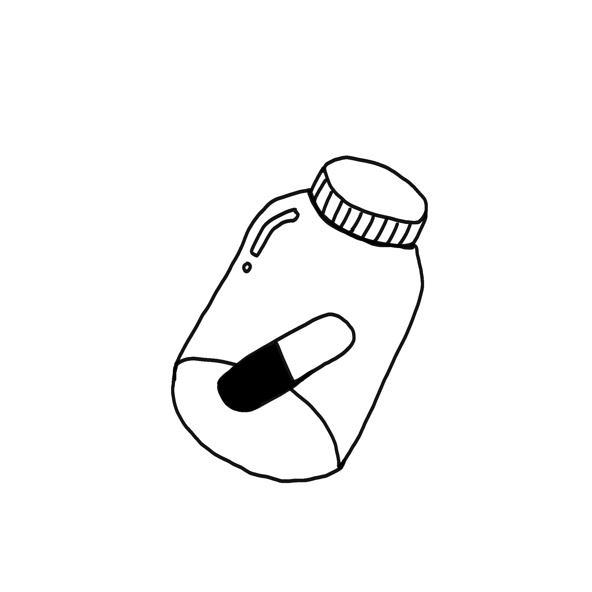
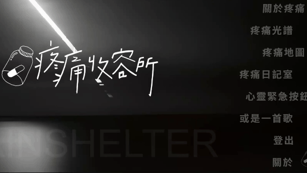
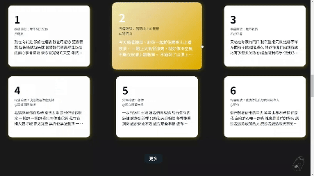
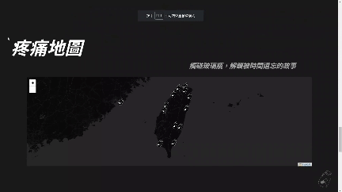

  

# PainShelter

<a href="https://painshelter.site/">PainShelter</a> is a platform dedicated to collecting painful and sorrowful memories. By sharing their own sadness, users may find their burdens lightened.

## About PainShelter

- Built reusable UI components using `Styled Components` to ensure visual consistency.

- Integrated `shadcn/ui` and `leaflet` third-party libraries to diversify project presentations and enhance functionality.

- Applied `Firebase Firestore` as database, and `Firebase Hosting` with deployment of react app.

## Built with

#### Base

- React
- Zustand
- Firebase
- Styled Components

#### Libraries

- ldrs
- Shadcn
- gsap/react
- lucide-react
- survey-react
- react-leaflet
- react-toastify

## Demo

- Clickable function menu in the top right corner of the page. 
  
    
- Featured articles that let users explore external websites. 
  
    
- Tap the map icon to download your favorite articles to your device. 
  

## Guest mode

| title         | content        |
| ------------- | -------------- |
| test email    | test@gmail.com |
| test password | test1234       |

## Contact

